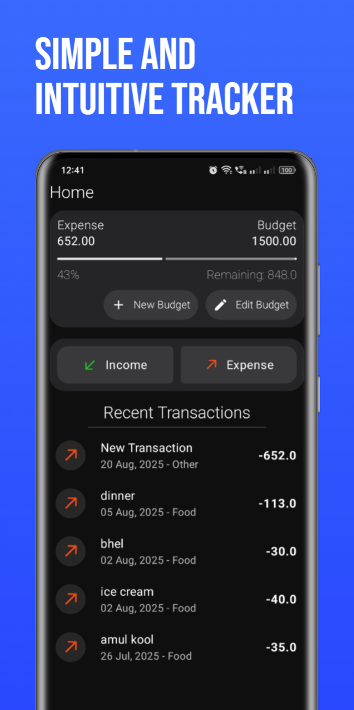
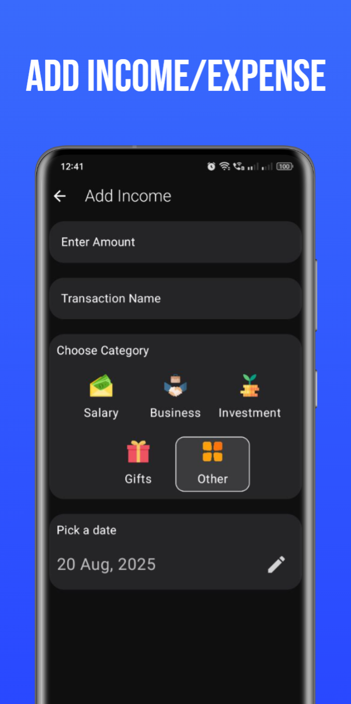
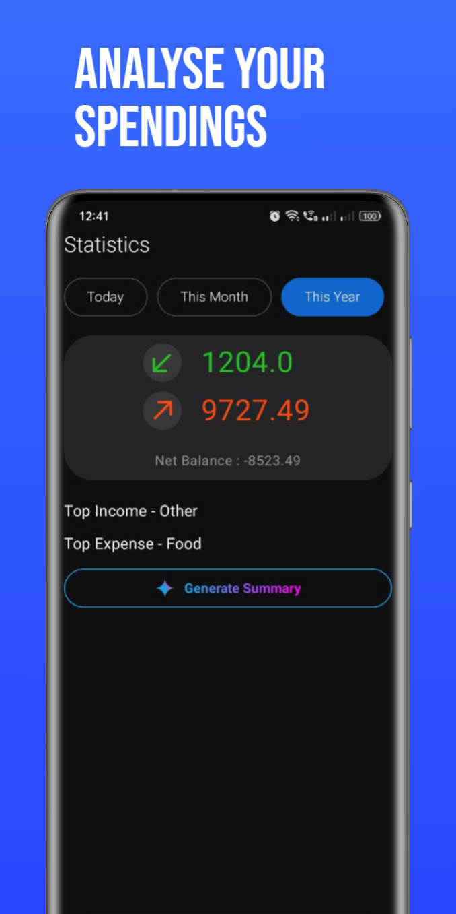
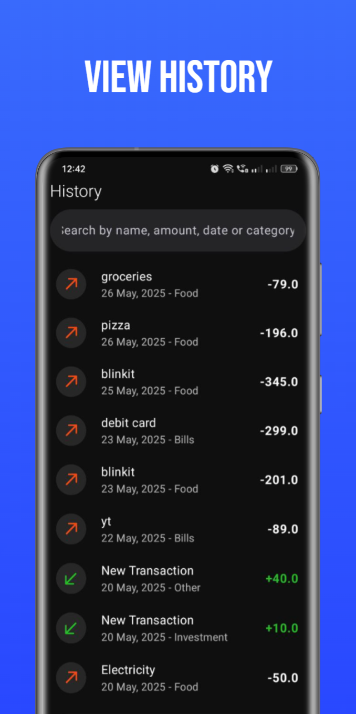

# 💸 Cash Control

**Cash Control** is a fast, modern, and intuitive expense tracker app built with **Kotlin**, **Jetpack Compose**, and **Firebase**. It helps users manage their finances by tracking expenses, income, and budgets—all in one place. Plus, get smart AI-powered summaries with just a tap!

---

### App Screenshots

  
  
  
  
  

## ✨ Features

- 🔐 Google Sign-In with Firebase Authentication
- 📱 Delightful Animations
- 📊 Track income, expenses, and budgets
- 🧾 View all transactions with and search by name, category or date
- 📆 Horizontal pager for **Today**, **This Month**, and **This Year** statistics
- 💡 AI-powered insights using **Gemini**
- ☁️ Realtime sync with **Firebase Firestore**
- 🎨 Beautiful, smooth UI with Jetpack Compose
- 🔔 Responsive navigation based on user login state
- 📱 Designed for performance and offline resilience

---

## 🧱 Tech Stack

- **Kotlin**
- **Jetpack Compose**
- **MVVM + Clean Architecture**
- **Koin** for Dependency Injection
- **Coil** for loading profile photo
- **Firebase Firestore** (cloud database)
- **Firebase Authentication** (Google Sign-In via Credential Manager API)
- **Google Gemini** (AI summary generation)
- **Material Design 3**

---

## Future Updates in mind

- **Recurring Transactions**
- **Notifications for budget limits**
- **Widgets**
- **Create excel reports**

